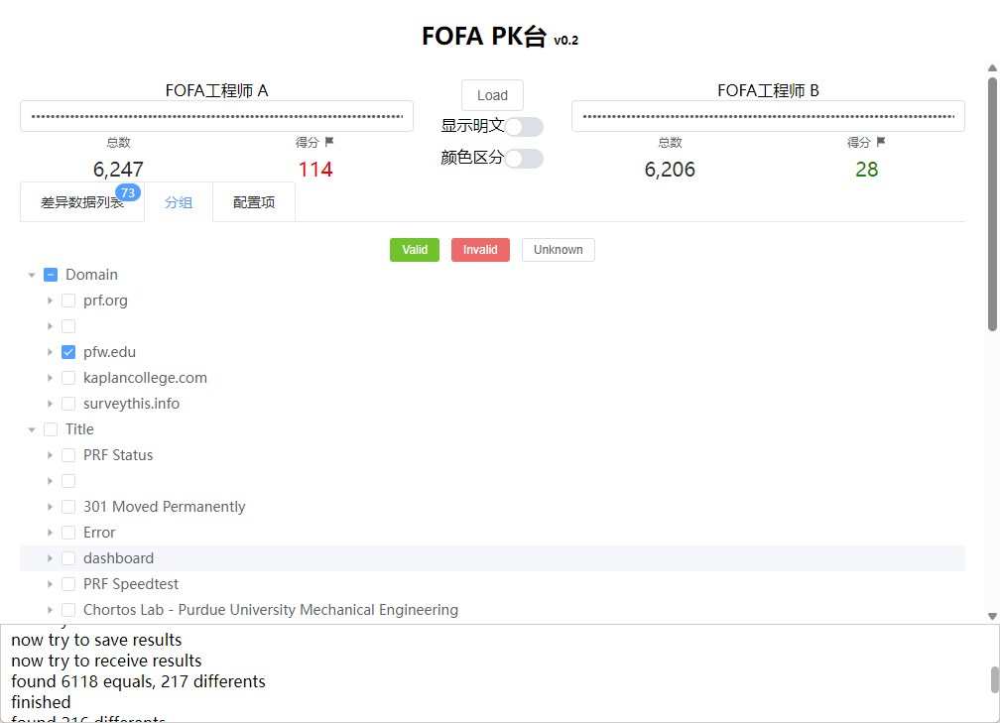

# FOFAPK
fofapk 用于对FOFA工程师的线索梳理能力进行PK，来验证能力的强弱。

针对同一个任务（比如企业的互联网暴露面梳理或者某个厂商的所有设备），两个参赛者提交FOFA的查询语句，看哪个参赛者提交的语句更好（全面且准确）。

## 实时开发
- 安装golang环境和wails（`go install github.com/wailsapp/wails/v2/cmd/wails@latest`）。
- 安装nodejs

根目录下运行：`wails dev`

注意：确保环境变量配置了`FOFA_KEY`。

## 编译

根目录下运行：`wails build`.

## 效果

## 可增加特性
- [x] 显示两边的IP总量
- [ ] 记录操作的历史，便于检查
- [x] 聚类相同项目，比如domain/asn/title/fid之类的
  - 因为两边对比的时候，很有可能是基于一种情况就能判断对错，比如根域名，比如asn之类的，这时候就可以批量进行处理，而不用一条一条进行了。
  - [x] domain
  - [x] title
  - [x] asn
  - [x] fid
  - [x] 按照数量排序
    - [ ] 显示数量
- [ ] 扫码登陆，在各自的电脑上点击提交
- [ ] 统计具体的输赢情况数据